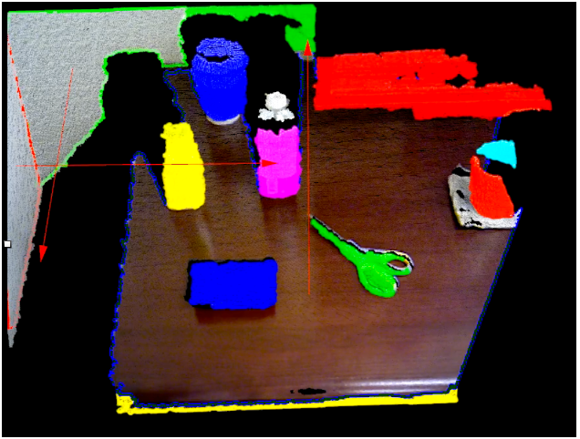
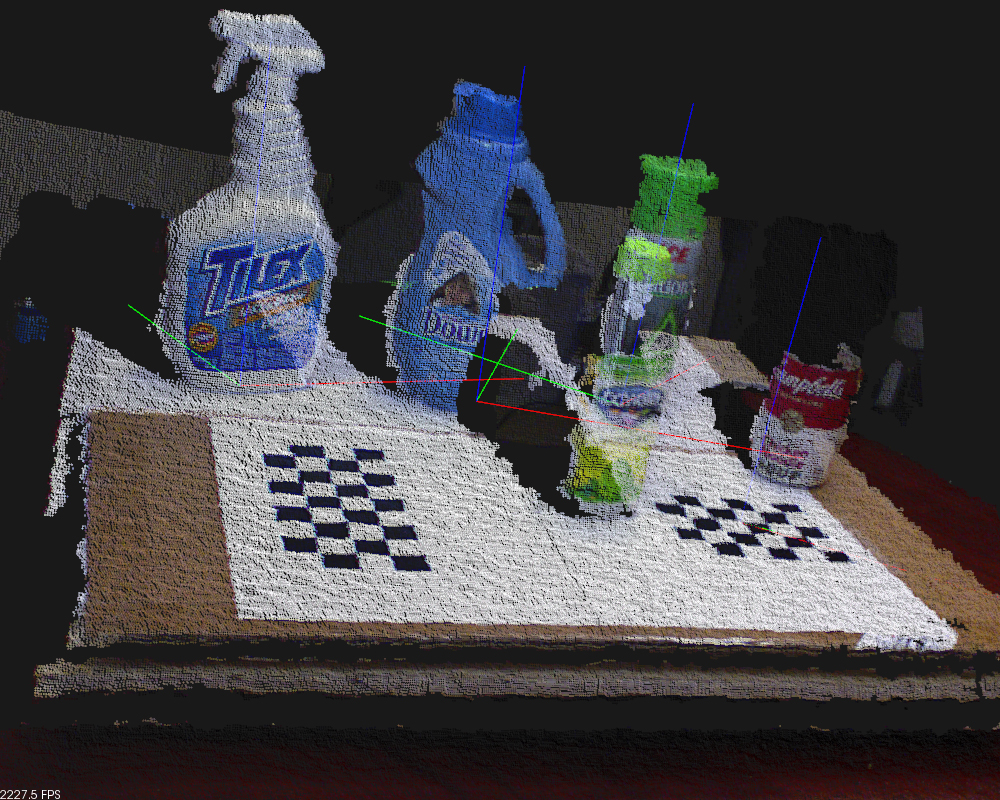

# Parallel Point Cloud Processing and Segmentation
## Ardra Singh (ardras)
## Rohan Varma (rohanv)

<a class="nav"  href="https://rohanvarma16.github.io/pcseg/checkpoint" target="_blank">Checkpoint Report</a>

### Summary
In our project we intend to implement a framework for segmenting point clouds on GPUs. We plan on modifying algorithms based on sequential implementations to design subsampling and segmentation building blocks such that they are amenable to a fast CUDA implementation. We intend on providing a comparison between a CPU-based implementation and a parallel implementation that runs on a GPU. Since segmentation is a critical first step in many applications that process point clouds, a fast implementation that is still accurate and is amenable to processing consecutive frames of point clouds at a high frame rate is valuable.

### Introduction and Background
- A large number of 3D points on an object's surface measured by a sensing device are called a 3D point cloud. Other than 3D
coordinates, a 3D point cloud may also comprise some attributes, such as color, temperature and texture. With the recent
development of 3D sensing technologies, 3D point clouds have become an important and practical representation of 3D objects
and surrounding environments in many applications, such as virtual reality, mobile mapping, scanning of historical 
artifacts, 3D printing and digital elevation models.  

- 3D point cloud segmentation is the process of
classifying point clouds into multiple homogeneous regions, the
points in the same region will have the same properties.This problem has many applications in robotics such as
intelligent vehicles, autonomous mapping, navigation, household tasks and so on.

### Framework:
Typically, the number of points in point clouds are on the order of millions. These are however highly redundant and noisy with many outliers. Hence, there is substantial gain from sampling this point cloud into a fewer number of points. However, it is suboptimal to downsample randomly. Instead, in our first building block we want to downsample the point cloud while preserving contour, color and other feature information. This makes computation in the following blocks substantially cheaper since their complexities are polynomial in the number of points. We plan on parallelizing the graph-based approach described in reference 1. We also note that the sampling operator here is shift and rotation invariant. This is particularly useful for real-time consecutive frame processing applications such as tracking and registration since we may not need to compute the sampling operator every time step.

After downsampling our point cloud, our next building block segments this point cloud. There are multiple approaches to do this, but in our first implementation, we want to use the mean-shift or the quick-shift algorithm to perform the segmentation. This approach is again parallelizable. 

### Challenges
 Point cloud data is usually noisy, sparse, and unorganized. The segmentation task is even more challenging than that for images because of the high redundancy, uneven sampling density, and the lack of explicit structure in point cloud data.  

 In our CUDA approach, we plan on partitioning our volume into 3d cubes/voxels such that each thread block corresponds to
 a voxel. Because of the nature of the computation, there needs to be sharing of information between neighboring voxels. Minimizing inefficiencies here is a major challenge in maximizing speed. 
 
  Workload Imbalance: There is workload imbalance because of the uneven density of points. In CUDA, this corresponds to block-level imbalance. In addition, in the segmentation block, there is also some thread-level imbalance because of conditional statements. Minimizing execution divergence because of this is also a challenge.
  In both the segmentation and sampling blocks, the computation done for each point is spatially local. We can take advantage of this by designing efficient data structures and memory access patterns.

  At the same time, while performing optimizations and modifications that maximize speed and throughput, we still want to preserve sufficient accuracy in our segmentation.

### Resources

- Computation
We are starting from scratch. We intend on using the PointCloudLibrary(PCL) for I/O and visualization purposes. 
Resources we will use to implement our project on are:
 1. GHC machines with NVIDIA GTX 1080 GPUs

- References to the algorithms we intend on using, parallelizing and/or modifying:
1. Fast Resampling of 3D Point Clouds via Graphs: https://arxiv.org/abs/1702.06397
2. Really quick shift: Image segmentation on a GPU http://www.vision.cs.ucla.edu/papers/fulkersonS10really.pdf
3. Min-Cut Based Segmentation of Point Clouds http://www.cs.princeton.edu/~funk/s3dv09.pdf
4. 3D Point Cloud Segmentation: A survey http://ieeexplore.ieee.org/document/6758588/

### Goals and Deliverables

Plan to Achieve:
- Efficient GPU and CPU implementations of segmentation of large point clouds that achieves frame rates that are viable for real-time applications (5 frames/sec)
- Full comparison and analysis based on both accuracy and speed both between our implementation and other off-the-shelf implementations.

Hope to Achieve:
- Build a real-time parallel implementation of an object tracker built on top of our point cloud segmentation framework.

Demo:
- We plan on demoing visualizations of our segmentation framework on large point clouds as well as speedup graphs comparing our parallel and sequential implementations. 

### Platform Choice
We intend on using C++ for our sequential implementation as our benchmark. For our parallel implementation, we intend on using CUDA and NVIDIA GPU's. GPU's are especially efficient for 2D/3D image processing applications because of how most algorithms lend themselves to spatially local computations that can be run in parallel. This is the case for our framework as well. 

### Schedule
- Week 1: Environment setup, start C++ sequential implementation for benchmarking
- Week 2: C++ implementation of sampling and segmentation
- Week 3: Start CUDA implementation of sampling and segmentation
- Week 4: Finish CUDA implementation. Do further optimizations if possible.
- Week 5: Write report. If possible, build on this framework for an object tracker application.

