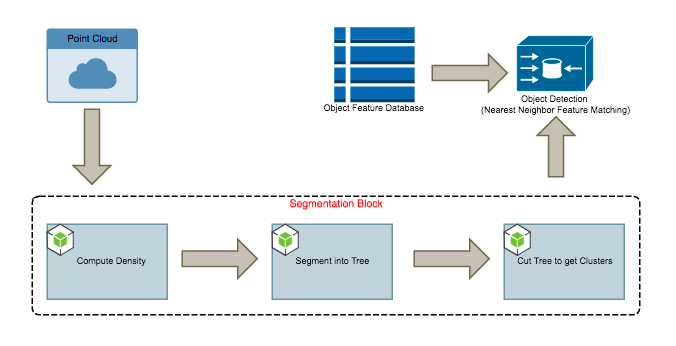
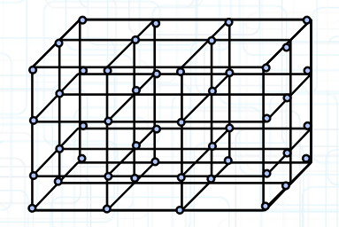
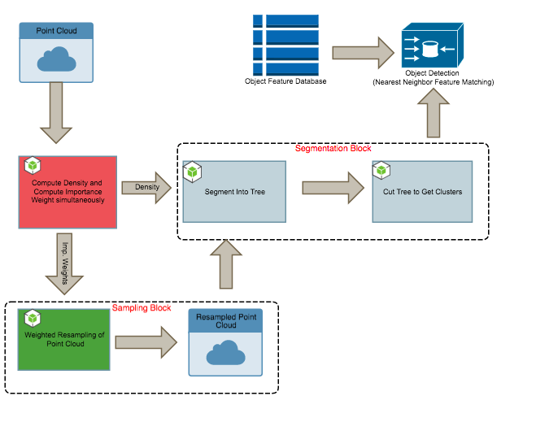
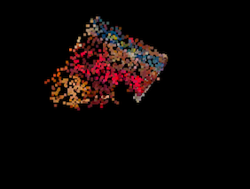
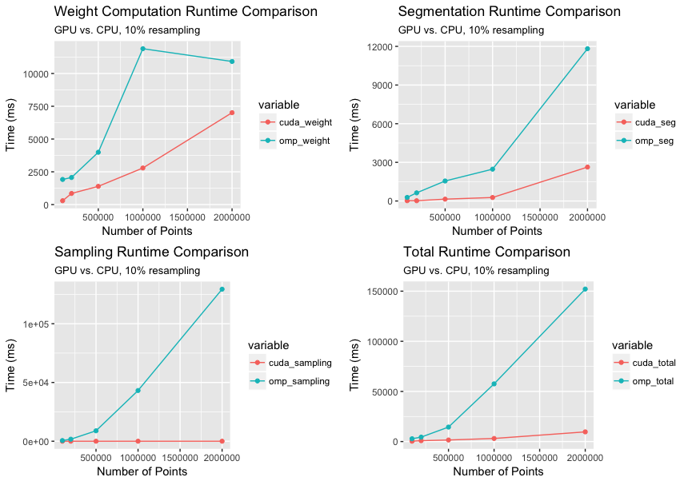
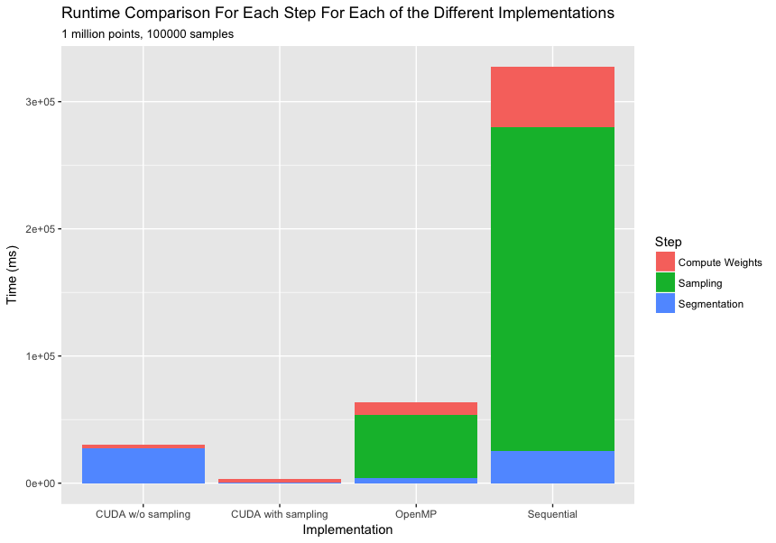
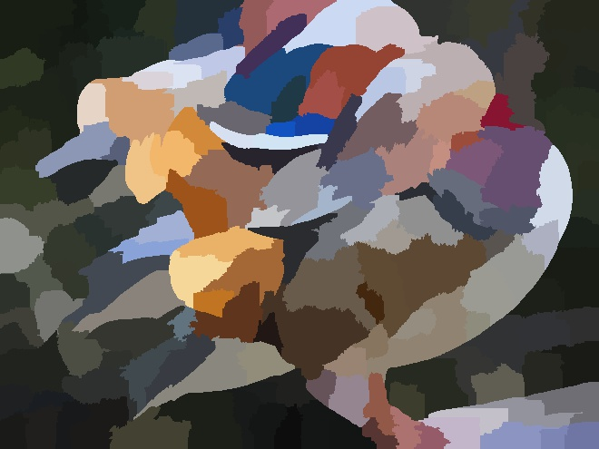
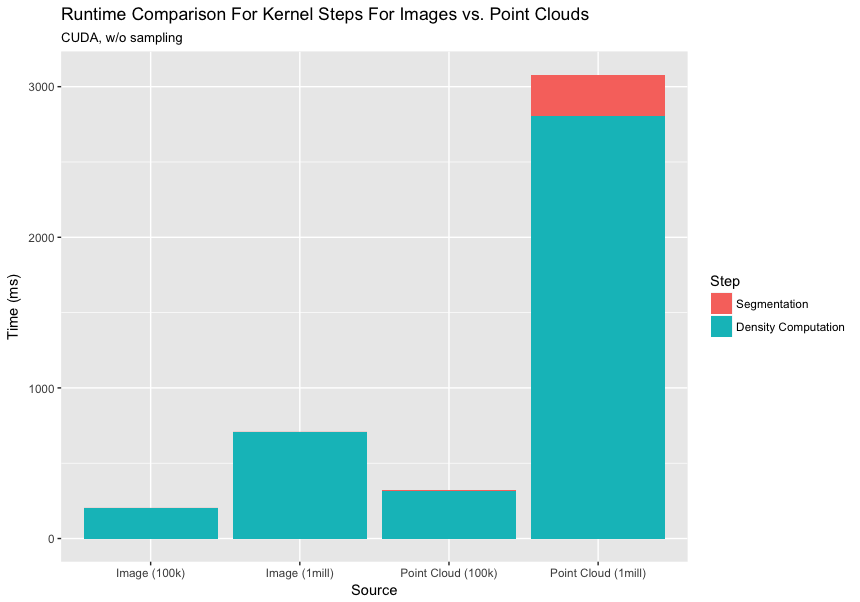

# Parallel Point Cloud Processing and Segmentation
## Ardra Singh (ardras)
## Rohan Varma (rohanv)

<div style="text-align: center;"><a class="nav"  href="https://rohanvarma16.github.io/pcseg/proposal" target="_blank">Proposal</a></div>

<div style="text-align: center;"><a class="nav"  href="https://rohanvarma16.github.io/pcseg/checkpoint" target="_blank">Checkpoint Report</a></div>

## Introduction and Brief Overview:

In our project, we study spatially local computation on 3-d pointclouds of sizes in the millions and present two main ways with which we can increase speed/throughput on a GPU while preserving the performance accuracy of the end result. By spatially-local, we mean that each pixel independently, performs a computation based on the points in its local neighborhood.
There are two main contributions we want to highlight here. First, we show a mapping of approximate local neighborhoods to CUDA thread blocks to accelerate GPU throughput while preserving accuracy.
Secondly, we implement a fast parallel version of the contour-preserving resampler presented in <a class="nav"  href="https://arxiv.org/abs/1702.06397" target="_blank">this paper</a> to subsample the pointcloud (preserving just 5% of the points does well!) while preserving important features. This helps to alleviate the cost of the high redundancy, while still preserving output accuracy.

Specifically we chose to study the critical problem of segmentation which is an important step in many computer vision application pipelines. That is,  “clustering” point clouds into multiple homogeneous regions, the points in the same region will have the same properties. This problem has many applications in robotics such as intelligent vehicles, autonomous mapping, navigation, household tasks and so on. Point clouds are a particular challenge because they often have uneven point density, high redundancy, and are noisy with many outliers. 

Since it not clear what is the best “metric” for evaluating segmentation, we build a simple object detector (by computing features and finding the nearest neighbor in a pre-computed object feature database). On a high level, we say a segmentation of good quality, if it’s able to reliably detect objects which we have trained upon. We would like to emphasize here, that the object detection is not the main focus of our project. Instead, we show how we can perform fast processing of point-cloud data on a GPU.

We primarily use the <a class="nav"  href="http://rgbd-dataset.cs.washington.edu/dataset/" target="_blank">RGB-D Object Database</a> which has point clouds of scenes with objects like below as well as models of the objects themselves which we use to train features (using the point cloud library).


## Design 1:


The block diagram of the initial design is as above. We use the quick shift algorithm to perform the image segmentation. It is amenable to parallelism because of it’s computational characteristics and memory access patterns as described below.

### Quick Shift Segmentation:

The quick shift segmentation occurs in 2 steps, it first computes a local density estimate before assigning a parent to every node. Both steps are spatially local since each point performs a computation by iterating over its local neighborhoods. We choose the neighborhood sizes to not only ensure accuracy but also to control the granularity of the segmentation.

```
function compute_density() {
  for each point p in pointcloud:
    for each neighbor x in neighborhood(p):
      density[p] += dist_estimate(p,x);
    end
  end
}
```

```
function construct_tree(){
  for each point p in pointcloud:
    for each neighbor x in neighborhood(p):
      if(density[x] > density[p] && dist(x,p) < min_dist)
        parents[p] = x;
        min_dist = dist(x,p)
    end
  end
}

```
### Implementation Details: 
The first contribution is to leverage the spatial local characteristics of the computation to voxelize the pointcloud and map each voxel to a CUDA thread block. This way every point in a voxel performs the same computation over its neighborhood and possesses the same memory access patterns. This change to the original framework makes it well suited for a fast CUDA implementation. We voxelize by cubing the minimum bounding box of the point cloud. The neighborhood of a voxel is its neighboring voxels.
We note that to compare to the sequential version fairly, we use a k-d tree (efficient for spatially local data access) to store the point cloud.


<figure class="half">


</figure>


## Design 2:

After our first design, we wanted to accelerate the segmentation by taking advantage of the redundancy in the point cloud. i.e We ask, are we processing more points than we need to?



Here we introduce our second main contribution, a resampling block into our design. The sampling step occurs in two stages, we first need to assign an importance weight to each point (effectively a local high pass filter, again a spatially local computation), before performing a weighted sampling of the points. The latter can be implemented quickly with the help of CUDA  thrust libraries. It turns out we can subsample by preserving up to 5% of the total number of points and preserve detection performance.


### Importance Weight Sampling Algorithm:
We show very basic pseudocode below to show the structure of the weight assignment algorithm. As can be seen below, the weight computation is again a spatially local computation since each point iterates over its local neighborhood to compute its importance weight.

```
function compute_weight() {
  for each point p in pointcloud:
    weighted_sum =0; 
    for each neighbor x in neighborhood(p):
      weighted_sum += weighted_neighbor(p,x);
    end
    weight[p] = dist(x, weighted_sum)
  end
}
```
We then sample points according to these weights. We mention a caveat here in that, our weighted CPU-based sequential sampler, performs the sampling naively with O(KN) (K is the number of samples). (The sampler pre-computes a rolling sum of the normalized weights and then samples a uniform random number and see in which bin it falls (binary search)). While we implement this same algorithm on CUDA, this is not the fastest way to perform weighted sampling on a CPU. A faster CPU-based implementation would be based on the Alias-Walker method which samples in O(K+N). 
Another interesting point is that the sampler helps to smoothen the uneven density of points across the space. 

## Results:
Below is an image of the result of the segmentation on the kitchen scene. The original point cloud has around 3 million points and we preserve only 80000 samples. We also show the output of the object detection phase for a cereal box using the segments generated by our point cloud segmentation framework. 



### GPU vs. CPU:
Our main focus was to maximize segmentation throughput on a GPU, and so, although we optimized the CPU implentation with openMP pragmas to run on 16 threads, it is still not the best possible CPU implementation.

The graph shown below compares the runtime for various computation steps of the segmentation process for our openMP and CUDA implementations. The overall speedup of the CUDA implementation over the openMP implementation increases from 8X for 100k points to ~20X for 2 million points. This non-linear increase in speedup is in sync with what we expect since increasing the number of points increases the point density which in turn increases per voxel computation at a cubic order. Also, the speedup of the sampling step is more than 1000X because we use highly optimized thrust library functions for the parallel scan and gather operations.



### Time with Sampling vs. Without Sampling:
This graph compares speedup of CUDA with and without sampling over the multithreaded openMP implementation. Without sampling the CUDA implementation is only 2X faster, however incorporating the sampling step in CUDA boosts the speedup up to ~20X.
We note that the overhead of sampling is largely negligible compared to the drastic speedup of the segmentation block. We note that we sample a range of points from 10k to 100k points which preserves detection performance. In addition, sampling is especially useful when doing coarse segmentations (since we need to search over larger neighborhoods, higher density would imply extremely expensive computations).


### Comparison with Segmentation of an Image:

Images exhibit regularity and here we intend to analyze how much the unevenness density of the points in the space affects our performance. Irregularity affects the number of points each block/voxel processes. This in turn leads to extremely skewed workload imbalance patterns. We equalize the number of pixels in the image and the number of points in the point cloud. 

Example of image segmentation, original image and segmented image:





## Summary

## References

1. Fast Resampling of 3D Point Clouds via Graphs: https://arxiv.org/abs/1702.06397
2. Really quick shift: Image segmentation on a GPU http://www.vision.cs.ucla.edu/papers/fulkersonS10really.pdf
3. Min-Cut Based Segmentation of Point Clouds http://www.cs.princeton.edu/~funk/s3dv09.pdf
4. 3D Point Cloud Segmentation: A survey http://ieeexplore.ieee.org/document/6758588/


