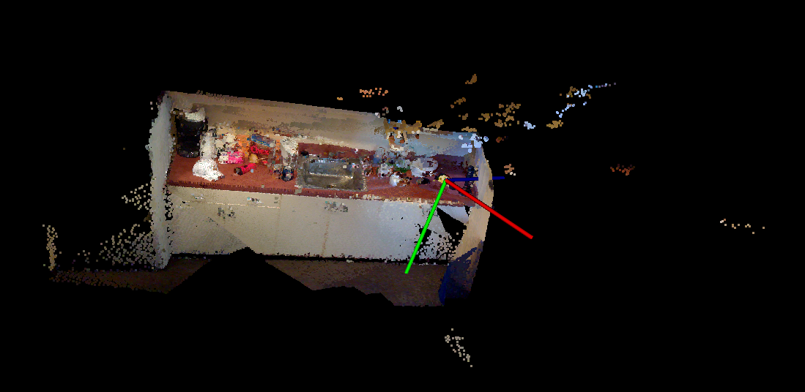
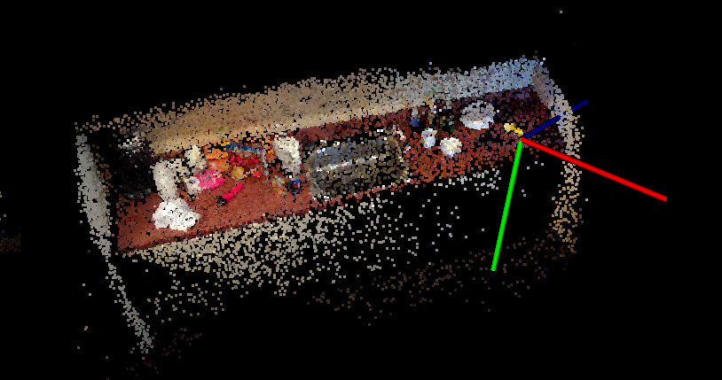
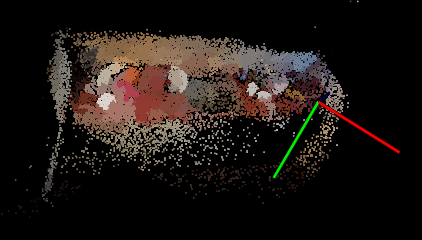

# Parallel Point Cloud Processing and Segmentation
## Ardra Singh (ardras)
## Rohan Varma (rohanv)

### Process Review
We have finished implementing a CPU version of the parallel downsampling and segmentation blocks. Below are images of the original point cloud with 3 million points, the resampled point cloud with 10000 points and the resulting segementation. 
We have finished implementing the sampling block in CUDA. Our initial implementation shows significant speedup and we are currently working on the segmentation block. 

### Goals and Deliverables
Our goals haven't changed and we believe we are on track to meeting our original deliverable of a fast segmentation of large point clouds. 
### Revised Schedule

|   Time    | What we plan to do | Status |
|:---------:|:-------------------|:-----:|
| April 1 ~ April 7  | Environment setup, start C++ sequential implementation for benchmarking | DONE |
| April 8 ~ April 14  | C++ implementation of sampling and segmentation | DONE |
| April 15 ~ April 21 | Start CUDA implementation of sampling and segmentation | Finished sampling in CUDA |
| April 22 ~ April 26 | Finish CUDA implementation | Currently implementing segmentation in CUDA |
| April 27 ~ May 1 | Do further optimizations and testing of CUDA Implementation |  |
| May 2 ~ May 5 | Compare the CPU and GPU implementations |  |
| May 6 ~ Parallel Competition Day | Write final report and prepare for presentation   |    |

### Resources/Issues
Due to the large size of the pointclouds we are processing, we have issues with the space limit on the GHC servers. To get around this, we might need to use AWS or an increased disk quota on GHC.
